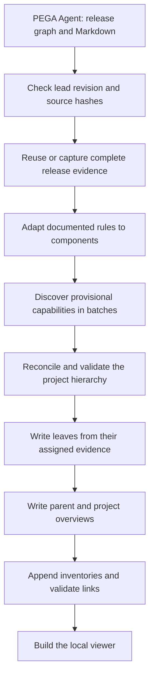

# CodeWiki runbook: complete UnipolLead `lead` documentation

This runbook explains how to generate, inspect, serve, and refresh documentation
for the complete `lead` release of project `unipolLead`. CodeWiki consumes the
PEGA Agent's published Neo4j graph and referenced Markdown. It inventories the
entire selected release, including disconnected rules. No starting rule, seed,
or traversal depth is required.

## Project, input, and completed run

| Item | Value |
| --- | --- |
| CodeWiki fork | `/home/dcolombaro/projects/Genertel/codewiki-pega` |
| PEGA Agent input | `/home/dcolombaro/projects/Genertel/pega-kb-codex-GTLLife-bundle` |
| Upstream MCP server | `pega_kb.mcp_server` |
| Project / release selector | `unipolLead` / `lead` |
| Resolved release | `unipolLead::Lead::01.01.01` |
| Functional wiki | `runs/unipollead-lead-wiki-functional-20261001-v4/` |
| Earlier comparison run | `runs/unipollead-lead-wiki-20260930-v6/` |
| Viewer address | <http://127.0.0.1:8766/index.html> |

Both completed runs use the same evidence snapshot: **480 entities, 793 directed
relationships, and 438 official Markdown references**. The earlier v6 run
assigns 437 documented rules to 16 leaf chapters under four capability
overviews. The functional run assigns those same 437 rules to 17 leaf chapters
under five capability overviews, for 23 Markdown pages including the project
overview. These counts describe this captured revision; later input updates
may change them. Selecting `lead` explicitly avoids counting the additional
`leadtest` materialization again.

The functional run uses `--doc-type functional`. Its chapters describe
configured capabilities, conditions, decisions, outcomes, and exceptions in
reader-facing terms. Every leaf has direct links to official Markdown, while
its complete rule and relationship inventory is linked under
`evidence/inventories/`. In a check of the finished run, all 437 rule owners,
their 774 captured outgoing relationship receipts, 17 inventories, local
Markdown links, and the generated viewer were present. The remaining 19
captured relationships originate from supporting entities and remain in the
evidence package.

The run's `evidence-package.json` confirms the complete-release scope. These
fields belong to its `scope` object:

```json
{
  "mode": "project",
  "discovery": "complete_release_inventory",
  "release_slug": "lead",
  "seed_entity_ids": [],
  "complete_for_requested_scope": true
}
```

Relative paths and generation commands below use the CodeWiki fork directory
as their base.

## 1. View and stop the wiki

From any directory in a WSL terminal:

```bash
codewiki pega-serve
```

The command loads the fork's `.env.local`, uses
`PEGA_PROJECT_ID=unipolLead`, locates the latest completed project run, and
serves it on port 8766. It prints the selected run directory and URL. Keep the
terminal open and visit <http://127.0.0.1:8766/index.html> in your Windows
browser. The command does not open the browser automatically.

Press Ctrl-C in the serving terminal to stop it. Run the same command to
restart it. If `codewiki` is absent from your terminal's `PATH`, use
`/home/dcolombaro/.local/bin/codewiki`.

To select the complete v6 wiki explicitly:

```bash
codewiki pega-serve --project unipolLead \
  --run-dir /home/dcolombaro/projects/Genertel/codewiki-pega/runs/unipollead-lead-wiki-20260930-v6 \
  --port 8766
```

To pin the functional wiki instead, use `--run-dir
/home/dcolombaro/projects/Genertel/codewiki-pega/runs/unipollead-lead-wiki-functional-20261001-v4`.

Viewing a completed run requires the HTTP server and local files. It does not
require Neo4j, Docker, an MCP connection, or model API calls. V6 links its
official Markdown through the evidence cache, so keep that cache and the PEGA
Agent input directory available to open source documents.

The functional run's sidebar contains:

- **Overview:** project introduction and links to capability areas.
- **Documentation:** five expandable capability areas and their leaf chapters.
- **Evidence:** official Markdown, relationship receipts, and linked module
  inventories supporting citations.
  Relationship receipts are supporting records, not module chapters.

Mermaid diagrams render with the local
`assets/mermaid-11.9.0.min.js` bundle. No external validation endpoint or CDN
is required. Use the HTTP URL above so requests for source documents resolve
through the server.

Rebuild the viewer from existing Markdown without generating prose:

```bash
cd /home/dcolombaro/projects/Genertel/codewiki-pega
codewiki pega-viewer --run-dir runs/unipollead-lead-wiki-functional-20261001-v4
```

## 2. Inspect the dependency graph evidence

### Complete typed graph

Open:

```text
runs/unipollead-lead-wiki-20260930-v6/evidence-package.json
```

This is the authoritative captured graph for the documentation run.

| Field | Meaning |
| --- | --- |
| `entities` | Captured release entities, their metadata, and linked `document_ids` |
| `relationships` | Directed edges with source/target IDs, types, and properties |
| `documents` | Document IDs mapped to source paths, hashes, and evidence paths |
| `scope` | Release selection, discovery method, counts, and completeness |
| `snapshot_key` | Identity of the package used by planning and writing |
| `unresolved_references` | Reference-resolution gaps preserved from the input |

Behavioral edges include `CALLS`, `READS`, and `WRITES`; `relation_kind`
supplies more specific meaning where present. Structural relationships such as
`HAS_PAGE_CLASS` also remain in the package. Available qualifiers such as
`step_path`, `http_method`, conditions, and resolution status are retained.
An edge describes configuration, not proof of runtime execution.

From the fork directory, print the scope and captured relationships:

```bash
python3 - <<'PY'
import json
from pathlib import Path

run = Path('runs/unipollead-lead-wiki-20260930-v6')
package = json.loads((run / 'evidence-package.json').read_text())
print(json.dumps(package['scope'], indent=2))
names = {entity['id']: entity['name'] for entity in package['entities']}
for edge in package['relationships']:
    source = edge['source_entity_id']
    target = edge['target_entity_id']
    kind = edge.get('properties', {}).get('relation_kind', '')
    print(f"{names.get(source, source)} -[{edge['relationship_type']} {kind}]-> "
          f"{names.get(target, target)} (edge {edge['id']})")
PY
```

The wiki's Mermaid diagrams provide selected explanatory views. The package
contains the complete captured relationship inventory. Edge receipts under
`evidence/edges/` preserve individual relationships and can be opened from
the viewer.

### CodeWiki component compatibility view

The PEGA route bypasses source parsing and `DependencyGraphBuilder`. It does
not create the source-code route's
`temp/dependency_graphs/*_dependency_graph.json` artifact. Instead, it adapts
documented PEGA rules into CodeWiki `Node` components.

For v6, a cached compatibility view is also present at:

```text
runs/unipollead-lead-wiki-20260930-v6/codewiki-components.json
```

Its outer object contains `snapshot_key`, `adapter_fingerprint`, and
`components`. The `components` object is keyed by rule ID and contains 437
records. The provider normally caches this projection beside the evidence
package in the shared scope cache; a run-root copy is not a required output
of every generation.

Each component includes `id`, `name`, `component_type`, `file_path`,
`relative_path`, `source_code`, and `depends_on`. Here, `source_code`
contains a serialized entity card with document references. Markdown bodies
are read through evidence tools. `depends_on` is a reduced compatibility view
of selected behavioral relationships between eligible rules. Use the package's
typed relationship array for the full graph and its qualifiers.

## 3. Inspect the module tree and rule ownership

Open these files:

```text
runs/unipollead-lead-wiki-20260930-v6/docs/module_tree.json
runs/unipollead-lead-wiki-20260930-v6/docs/first_module_tree.json
runs/unipollead-lead-wiki-20260930-v6/plan.json
```

`module_tree.json` drives page generation and navigation.
`first_module_tree.json` records the validated hierarchy before writing.
These two files are identical in v6 because PEGA writers preserve the plan.

The complete hierarchy is:

```text
platform-foundation
  application-foundation-and-audit
  security-portal-and-shared-utilities
agency-routing-and-allocation
  geographic-reference-data-and-agency-output
  round-robin-agency-allocation
  geo-meritocratic-allocation-engine
  routing-and-allocation-history
agency-search-service
  cercaagenzia-api-contract-and-orchestration
  cercaagenzia-routing-strategies
  agency-locator-contracts-and-mappings
agency-integration-services
  agency-retrieval-service
  fiscal-code-agency-link-storage
  fiscal-code-agency-submission-service
  fiscal-code-agency-lookup-service
  cip-agency-linkage-service
  agency-counter-service
  crif-outcome-recording
```

Every entry contains `components` and `children`. A leaf's `components`
array lists the exact graph IDs of the rules that chapter must explain. This
is **primary rule ownership**: each documented rule has one primary chapter.
Other chapters may discuss, cite, or link to the same rule. Ownership does not
modify PEGA rules or graph relationships.

A parent's `components` array combines its descendants' IDs for compatibility
with CodeWiki. The parent summarizes child chapters; this aggregate does not
create another primary ownership assignment.

`plan.json` contains `primary_owner`, module purposes under `rationale`,
full `module_paths`, supporting entities, and planning provenance. For example,
`agency-counter-service` owns 36 rules; its parent
`agency-integration-services` aggregates 125 across seven children.

Print the tree and rule counts:

```bash
python3 - <<'PY'
import json
from pathlib import Path

run = Path('runs/unipollead-lead-wiki-20260930-v6')
tree = json.loads((run / 'docs/module_tree.json').read_text())
def show(branch, level=0):
    for name, info in branch.items():
        children = info.get('children') or {}
        role = 'aggregate' if children else 'owned'
        print(f"{'  ' * level}{name}: {len(info['components'])} {role} rules")
        show(children, level + 1)
show(tree)
PY
```

## 4. Generate the complete `lead` wiki

### Prerequisites and configuration

The PEGA Agent must have completed XML processing, deterministic Markdown
generation, and Neo4j projection for `unipolLead` / `lead`. CodeWiki consumes
that published input without modifying the PEGA Agent implementation.

Generation requires:

- The CodeWiki fork and its Python environment.
- The PEGA Agent bundle, its Python environment, and referenced Markdown.
- The bundle's Neo4j instance. Start Docker Desktop and the relevant Neo4j
  container when that instance runs in Docker.
- Model configuration and credentials in the fork's `.env.local`.

| Variable | Purpose |
| --- | --- |
| `PEGA_PROJECT_ID` | `unipolLead` |
| `PEGA_RELEASE` | `lead` |
| `PEGA_KB_ROOT` | Absolute path to `pega-kb-codex-GTLLife-bundle` |
| `PEGA_PYTHON` | Bundle Python executable used to start its MCP server |
| `CUSTOMER_MODEL_BASE_URL` | Configured model API endpoint |
| `CUSTOMER_MODEL_ID` | Configured planning/writing model |
| `CUSTOMER_MODEL_API_KEY` | Model credential, kept locally in `.env.local` |
| `CODEWIKI_PEGA_CACHE_DIR` | Optional shared evidence-cache location |
| `CODEWIKI_PEGA_OUTPUT_ROOT` | Optional output root for chat generation and viewer discovery |

CodeWiki runs in its own environment. The `--mcp-command` argument starts the
upstream server using the PEGA Agent's Python environment.

### CLI generation

Load the existing configuration and choose a new output directory:

```bash
cd /home/dcolombaro/projects/Genertel/codewiki-pega
set -a
source .env.local
set +a

pega_run_dir="runs/unipollead-lead-wiki-$(date +%Y%m%d-%H%M%S)"

codewiki pega-generate \
  --project unipolLead \
  --release lead \
  --mcp-command "$PEGA_PYTHON" \
  --mcp-arg=-m --mcp-arg=pega_kb.mcp_server \
  --mcp-cwd "$PEGA_KB_ROOT" \
  --model "$CUSTOMER_MODEL_ID" \
  --model-base-url "$CUSTOMER_MODEL_BASE_URL" \
  --api-key-env CUSTOMER_MODEL_API_KEY \
  --output "$pega_run_dir"
```

The completed v6 wiki uses the original PEGA writing style. The completed
functional v4 wiki used the same captured input and added `--doc-type
functional` to this command.
It directs the batch discovery planner, the project-wide reconciliation pass,
leaf writers, and parent overviews toward business capabilities, conditions,
decisions, outcomes, and documented exceptions. It keeps exact technical rule
references in citations and the source inventory. Add `--instructions "Write
for business analysts"` when a particular reader audience matters. The
helper script accepts the same controls through `PEGA_DOC_TYPE` and
`PEGA_INSTRUCTIONS` in `.env.local` or the shell.

The run records the selected type and instructions in `plan.json` and
`evidence-manifest.json`. Changing either invalidates page and plan reuse for
the prior style, while the graph and Markdown evidence cache can still be
reused. `user-guide` describes supported user tasks; `functional` is the
appropriate type for an analysis of configured PEGA behavior without invented
screen or click instructions.

In the v6 captured evidence, all 438 official Markdown documents contain
`Configurazione` and none contains `Functional synthesis`. Selecting
`functional` changes CodeWiki's planning and explanation style; it does not
add a missing upstream synthesis. The writers describe configured behavior in
business terms and label business implications as inferred when the source
does not state them directly.

In the finished comparison, the functional run has 17 leaf chapters versus
v6's 16. Its leaf narratives contain 14,963 words versus 15,381 in v6; their
median length is 835 versus 940 words. The narrative has no graph ID or
`Rule-` type listings, while the earlier run included them and appended the
full inventories inside each chapter. The CercaAgenzia, round-robin,
geo-meritocratic, and Contatori chapters now organize their sections around
applicability, decisions, outcomes, and documented limits. These checks show
a clearer functional emphasis while preserving exact source traceability.

V4 uses a reviewed plan from `runs/unipollead-lead-wiki-functional-20261001-v3/reviewed-functional-plan.json`.
Review found that the central `AzioneMotoreGeoMeritocratico` selection activity
had been assigned to the CercaAgenzia entry chapter. The reviewed plan moved
that one rule to the geo-meritocratic strategy chapter, with all 437 rules still
owned exactly once. The corrected chapter now documents the configured
counter-versus-threshold selection. The project-wide reconciliation prompt was
also updated to keep a strategy's central decision rule with that strategy in
future automatic plans. A fresh automatic plan may differ, so inspect its
ownership and generated behavior before treating it as equivalent to v4.

The output directory must be new or empty. The command connects to the upstream
MCP server, checks the release revision, reuses or captures evidence, plans and
writes pages as needed, and builds `index.html`. It does not start an HTTP
server. After completion, run `codewiki pega-serve`.

If interrupted, repeat the generation command with the **same output directory**
and add `--resume-existing`. Keep the original `pega_run_dir` value. Resume
checks the current input against the saved package, plan, and tree before
reusing existing pages. If these no longer match, generate into a new directory.

### Generation from a coding assistant

Configure an MCP-capable assistant to start this fork's launcher:

```json
{
  "mcpServers": {
    "codewiki-pega": {
      "command": "/home/dcolombaro/projects/Genertel/codewiki-pega/scripts/pega_codewiki_mcp.sh",
      "args": []
    }
  }
}
```

The launcher loads the fork's `.env.local` and selects this checkout's code.
Ask: **"Generate documentation for the complete unipolLead project, release
lead."** The fork's `generate_pega_docs` tool takes these arguments:

```json
{"project": "unipolLead", "release": "lead"}
```

The tool creates a new output directory when none is supplied. It uses the same
revision checks, evidence cache, planner, and writers as the CLI and returns
the run and viewer paths. Serving remains a separate `codewiki pega-serve`
command.

## 5. From the full-release KB to final documentation



### Step 1: resolve the release and input revision

CodeWiki calls `catalog`, `list_releases`, and `kb_status` and resolves
`unipolLead` / `lead` to the application-release ID used in Neo4j.

The revision combines the release manifest's `content_hash` with SHA-256
hashes of its referenced Markdown. It detects graph projection changes and
Markdown edits. The cache distinguishes project, release, and complete-project
scope. Even an unchanged run performs status and source-hash checks.

### Step 2: reuse or capture the complete graph

If a valid complete-release package already matches the live revision, CodeWiki
reuses it. Otherwise, release-restricted `read_cypher` queries page through:

1. All `Scoped` nodes whose `release` is the selected application release.
2. All directed edges whose source, target, and edge belong to that release.

The adapter preserves exact identities, properties, direction, and available
call-site qualifiers. It checks counts against `kb_status`, rejects duplicate
identities and edges escaping the release, and includes disconnected nodes
through the node inventory. Capture does not depend on a traversal from an
entry-point activity.

### Step 3: reference the published Markdown

Each node's `markdown_path` identifies its official file. CodeWiki checks the
path remains inside the project's input tree, hashes the content, and associates
it with a document ID. The current bundle supplies deterministic Markdown
generated from XML, including the `Configurazione` sections used in planning.

The cache stores metadata and links to original Markdown. Runs link to that
evidence instead of duplicating the upstream corpus. `source_path` records a
document's origin, `sha256` identifies its content, and `metadata_sha256`
tracks its metadata record. Use `--bundle-evidence` explicitly when portable
copies are needed to move a wiki independently of the source tree and cache.

### Step 4: bind subsequent work to the evidence package

`evidence-package.json` fixes the entities, edges, document references, scope,
and snapshot identity for this run. A new capture rechecks the input revision
after retrieval to detect changes during acquisition.

Planning and writing use this package and its referenced local Markdown.
After capture, specialist searches and traversals operate on the graph in
memory. They cannot silently widen the input through new Neo4j queries.
Markdown evidence requests must name documents selected in the package.

### Step 5: adapt PEGA rules to CodeWiki components

An entity becomes a component when it has a PEGA rule type and at least one
linked official document in the package. `is_external` and `is_embedded`
remain provenance flags and do not disqualify an otherwise documented rule.
Other entities remain supporting context.

The component preserves the graph ID and document references. Its entity card
and reduced `depends_on` list support CodeWiki's shared machinery; the package
retains the full typed graph. V6 has 437 eligible rule components among its
480 captured entities. A matching component cache can be reused for the same
package and adapter fingerprint.

### Step 6: discover capabilities and plan the whole hierarchy

Planning has two stages:

1. **Detailed discovery:** batches receive rule metadata, complete selected
   Markdown sections, every captured relationship touching those rules, and
   cards describing adjacent entities. Ruleset/class groups organize requests.
   Complete sections are retained without a fixed rule-count cap; a group can
   exceed the prompt-size target. Each batch proposes capabilities and purposes.
2. **Project-wide reconciliation:** the global planner receives the full rule
   catalog, provisional capabilities and purposes, and summaries covering every
   captured directed relationship, including links across batches. It can merge,
   split, and move rules between groups and introduce parent capability pages.
   It does not receive all full Markdown sections again; its semantic context
   comes from the discovery findings.

Batch boundaries do not determine final chapter boundaries. Grouping favors
complete workflows: handlers, validation, contracts, and mappings belong
together when they explain one capability. Shared infrastructure can have its
own chapter. There is no fixed final page count.

The validator maps planning references back to exact graph IDs and checks the
hierarchy recursively. Every eligible rule needs exactly one primary leaf
owner. Parent components aggregate descendants. Missing rules, unknown IDs,
duplicate ownership, and conflicting names are rejected. An invalid global
proposal gets one correction attempt; a still-invalid result stops writing.

Coverage validation establishes consistency. Chapter usefulness also needs
review because intermediate summaries can omit context. V6 used 12 discovery
batches and 41 provisional groups. Its automatic proposal had four capability
areas and 17 leaves. Review merged history-class declarations into
`application-foundation-and-audit` and moved `crif-outcome-recording` under
integration services, leaving 16 leaves. These changes are recorded in
`plan.json` under `planning.editorial_adjustments`.

A reviewed `--plan-file` must name the exact evidence snapshot and pass the
same ownership checks.

#### What kind of planner is this?

The planner is part of CodeWiki's PEGA generation pipeline, but it is **not a
separate PydanticAI `Agent` with tools or an autonomous agent loop**. The
orchestrator is the Python function `plan_project_modules()` in
`codewiki/src/be/pega_planner.py`. It prepares the batches, calls the configured
`LLMBackend.complete()` for each discovery proposal, then calls the same
backend for project-wide reconciliation. `_reconcile_project_modules()` parses
the returned JSON and runs deterministic validation. If validation fails, the
orchestrator can request one corrected response. Python controls the order and
stops if validation still fails.

For the OpenAI-compatible backend used by this run, `complete()` sends each
crafted planner prompt as a single user message to the Chat Completions API. It
is a one-shot model request, not a system prompt installed on an agent. The
global request uses `PEGA_PROJECT_RECONCILIATION_PROMPT` and contains the full
rule catalog, provisional findings, and summarized relationships across the
release. It does not contain all source Markdown again.

| Pipeline part | CodeWiki execution | Agent/tool loop? |
| --- | --- | --- |
| Discovery and global planner | Python prepares inputs and calls `backend.complete()` with the batch or reconciliation prompt | No; single-shot completions coordinated by Python |
| Leaf chapter writer | `PydanticAIBackend.run_module_agent()` creates an Agent for the leaf, with PEGA evidence-reading and editing tools | Yes; the writer can make tool calls while writing its assigned page |
| Capability and project overviews | Python gathers child pages and calls `backend.complete()` with the overview prompt | No; single-shot completion |

Canonical CodeWiki does use agents for documentation: its README describes one
agent per leaf and recursive agents for complex modules ([upstream CodeWiki
README](https://github.com/FSoft-AI4Code/CodeWiki/blob/main/README.md)). This fork
retains the per-leaf agent writers for PEGA. PEGA mode disables their recursive
submodule delegation because the complete hierarchy is planned and validated
before writing. So the complete PEGA pipeline uses multiple tool-using writer
agents, while its planner is scripted orchestration around ordinary model
completion calls; the agents do not collaborate to design the tree.

### Step 7: retrieve context and write each leaf

The leaf's `components` list in `docs/module_tree.json` is its assignment map.
CodeWiki selects those rule IDs and provides the writer with:

- Compact entity cards and their associated document IDs.
- All captured directed relationships touching those rules, including links to
  other chapters and available qualifiers.
- The complete hierarchy, module purposes, and primary leaf assignments.

The writer calls `read_pega_evidence` for relevant Markdown sections. Responses
include line numbers, and a hash of each returned excerpt is recorded. This
material supports descriptions of step order, conditions, mappings, and
interactions with citations.

The specialist can resolve identity or dependency questions within the package.
Reads are guided by assigned rules and evidence references. The writer does
not rescan Neo4j or receive the entire Markdown corpus in every prompt. Each
writer edits its assigned page and cannot add submodules or change ownership.

### Step 8: write capability and project overviews

Once its children are written, each parent writer receives their generated text
and summarizes how they fit together. The root overview summarizes the four
capability areas. CodeWiki appends a child-page index to every parent and the
project overview.

The overview helper can excerpt long child pages: its current limit is 24,000
characters per child, reduced to 1,600 when there are more than eight children.
These limits apply to overview inputs; discovery retains complete selected
source sections. Every parent in v6 has at most seven children.

### Step 9: append inventories and check the output

After prose generation, CodeWiki builds a deterministic `Source inventory`
for every leaf. In the standard style it appends the inventory to the chapter.
With `--doc-type functional`, it writes the inventory under
`evidence/inventories/<module>.md` and adds one link from the chapter. The
functional wiki therefore keeps rule and edge listings available for audit
without making them part of the main explanation:

- **Owned rules:** each assigned rule's name, type, exact ID, and links to its
  official Markdown. Compare this list with `plan.json`.
- **Directed relationships:** every captured outgoing edge from those rules,
  with source/target IDs, type, available qualifiers, and a receipt link.
  Receipts preserve edge properties and supporting-document references when
  available.

For example, the v6 `docs/agency-counter-service.md` explains the API's GET and POST
flows. Its appended inventory lists 36 assigned rules, including `GETContatori`,
`POSTContatori`, validation, and contract definitions. Its edge receipts
support inspection of the configured interactions.

The inventory accounts for assigned evidence; it does not prove that every
rule is explained well or that a relationship executed. Edges originating
from supporting entities remain in the full package even when they do not
appear in a leaf's outgoing-edge inventory.

The generator checks required pages, document evidence, ownership, citations,
and local links. `evidence-manifest.json` records input and generation identity,
evidence reads, MCP requests, model-call telemetry, and incremental decisions.

### Step 10: build the viewer

CodeWiki renders generated pages into `index.html` and places the local
Mermaid bundle under `assets/`. The viewer loads official Markdown from
`evidence/` on demand and checks its captured hash. Start the server with
`codewiki pega-serve` to browse the result.

## 6. Refresh the complete project incrementally

Repeat the generation command for `unipolLead` / `lead` into a new empty
output directory, or repeat the full-project MCP request. The cache locates
the previous run for the same complete-release request.

| Situation | Pipeline behavior |
| --- | --- |
| Input revision and generation contract unchanged | Reuse the package, cached components, plan, and pages; no new model calls |
| Graph or Markdown changed, with compatible ownership and generation contract | Refresh complete-release evidence, compare entities/edges/documents, and regenerate affected leaves and ancestor overviews |
| Rule inventory, ownership, prompt, implementation, or model prevents safe reuse | Fall back to planning and generation as needed; record the reason |
| `--replan` requested | Reuse valid current evidence but rerun planning and all writers |

Source-hash checks still read referenced files to detect changes. Reusing a
package avoids full graph recapture and duplicate source storage; input
revisions are checked before reuse.

The evidence comparison can identify several affected leaves. Those leaves
and their ancestor overviews are refreshed while unaffected siblings can be
reused. A change affecting only `agency-counter-service`, for example, also
refreshes `agency-integration-services` and `overview`.

Use CLI `--replan` or MCP `replan: true` for a new planning and writing pass
even when inputs are unchanged. Inspect `evidence_refresh` and
`incremental_update` in `evidence-manifest.json` for the actual decision.

## 7. Locate artifacts and review evidence

All paths below are relative to
`runs/unipollead-lead-wiki-20260930-v6/`.

| Artifact | Purpose |
| --- | --- |
| `evidence-package.json` | Complete captured `lead` graph, document references, scope, and snapshot identity |
| `evidence/` | Source Markdown/metadata links; `edges/` contains relationship receipts |
| `codewiki-components.json` | Compatibility component cache present in v6; see section 2 |
| `plan.json` | Rule owners, purposes, module paths, supporting entities, and planning provenance |
| `docs/module_tree.json` | Hierarchy used by writers and viewer |
| `docs/first_module_tree.json` | Validated hierarchy saved before writing |
| `docs/*.md` | Leaf chapters, capability overviews, and project overview |
| `docs/metadata.json` | Generator/model information, component counts, and page list |
| `evidence-manifest.json` | Evidence storage, input/generation identities, telemetry, and refresh decisions |
| `index.html`, `assets/` | Local viewer and Mermaid bundle |
| `structure-review.json` | V6 ownership, source-reference, link, index, and navigation checks |
| `incremental-review.json` | V6 unchanged-input reuse check |

V6's structure review confirms one leaf owner for each of the 437 rules, valid
references for all 438 sources, and working local links and parent indexes.
Its incremental review records reuse of all 20 module pages and the project
overview with zero model calls and byte-identical Markdown.

V6 resumed an interrupted generation. The final manifest's model-call and
evidence-read telemetry covers the final resumed segment; it is not a complete
account of earlier writing calls. Planning-call telemetry is preserved in
`plan.json`.

When reviewing documentation:

- Compare substantive claims with cited Markdown and relationship receipts.
- Distinguish configured behavior from observed execution or persistence.
- Preserve unresolved and ambiguous references.
- Treat model-written interpretations as interpretations of deterministic input.
- Check chapter coherence as well as coverage. Structural checks do not prove
  every generated semantic statement.

## 8. Where the PEGA adaptation changes CodeWiki's pipeline

These differences explain the implementation used for this complete `lead` run.

| Stage | Usual CodeWiki codebase pipeline | Complete `lead` adaptation |
| --- | --- | --- |
| Input analysis | Parse source with language analyzers, including TreeSitter/ASTs | Consume the published release graph and Markdown; XML parsing remains upstream |
| Dependencies | Build source dependency-graph JSON | Capture typed release edges in the evidence package and derive compatible components |
| Planning | Cluster source components using dependency context | Discover capabilities in batches, then reconcile and validate the full hierarchy |
| Leaf context | Read assigned source components | Use assigned graph IDs and document references to read official Markdown sections |
| Module structure | Writers may add submodules | Validate the PEGA tree before writing and preserve it during generation |
| Parent pages | Summarize child documentation | Summarize capability chapters and add child indexes |
| Refresh | Compare repository changes | Compare release revision, graph records, and referenced Markdown hashes |
| Mermaid | May validate diagrams during writing | Disable remote validation and render with the bundled local script |

Both routes share CodeWiki's module writer framework, tree, overviews,
metadata, and viewer. The PEGA adaptation supplies the source contract,
component mapping, planning rules, writer instructions, and evidence tools.

## Implementation references

- [Generation and viewer CLI](../codewiki/cli/commands/pega.py)
- [Revision and cache decisions](../codewiki/src/be/pega_refresh.py)
- [PEGA MCP provider and component adaptation](../codewiki/src/be/sources/pega_mcp.py)
- [Discovery, reconciliation, and ownership validation](../codewiki/src/be/pega_planner.py)
- [Planning and writing prompts](../codewiki/src/be/pega_prompts.py)
- [Writer context and tools](../codewiki/src/be/agent_factory.py)
- [Generation and incremental page reuse](../codewiki/src/be/pega_documentation_generator.py)
- [Local viewer](../codewiki/cli/pega_viewer.py)
- [MCP generation entry point](../codewiki/mcp/tools/pega_generation.py)
